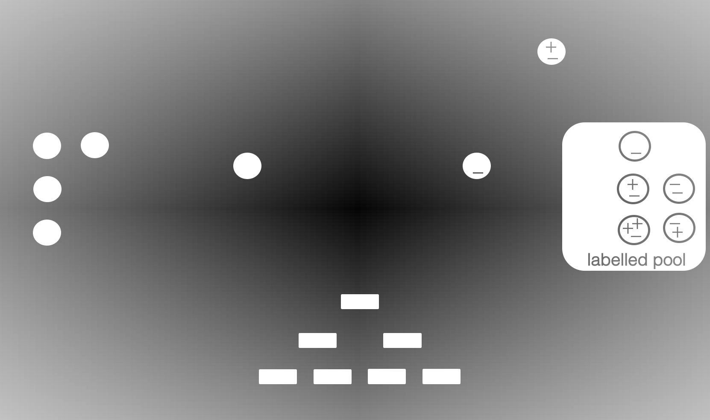
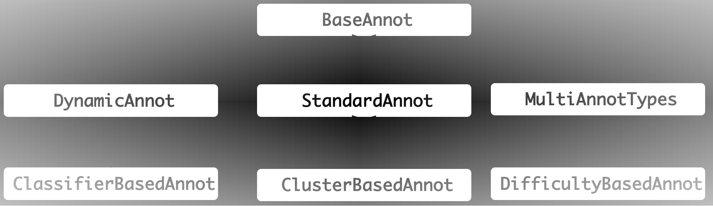

Overview
========

Humans are not perfect, they are uncertain and prone to error.
So are the annotators in a real world active learning setting.

*annotlib* is here to help you test the performance of your active learning strategies with uncertain annotators.

💌 we would love to hear from you (feedback, request to develop, or feature requests):

Marek Herde: marek.herde@uni-kassel.de

Adrian Calma: adrian.calma@uni-kassel.de [linkedin](https://www.linkedin.com/in/adrian-calma/)

Our library is not a full active learning framework but focuses on the modelling of annotators in a
Python environment.
However, our library may be combined with the Python active learning framework *libact* https://libact.readthedocs.io/en/latest/overview.html 

Introduction -- Why annotlib?
-----------------------------
The Python package *annotlib* is a library modelling human annotators in an active learning setting.
Solving classification problems by using supervised machine learning models requires labels.
That is, we need pairs of samples and the correspoding labels (i.e. the class to which they belong).
However, labelling these samples generates cost (e.g. workload, time, etc.), which we would like to reduce.
Thus, active learning strategies aim at
reducing these cost by selecting samples, which are the most useful for training a classifier :cite:`mherde:Settles2009`.

In real-world scenarios, human annotators are often responsible for providing the labels.
Unfortunately, there is no guaranty for the omniscience of those annotators.
Hence, annotators are prone to error, respectively uncertain, so that the labels assigned to samples may be
false :cite:`mherde:Calma2016`.
The labelling performance of an annotator is affected by many factors, e.g. expertise, experience, concentration,
level of fatigue and so on :cite:`mherde:Calma2017`.
Moreover, the difficulty of a sample affects the correctness of a labelling process :cite:`mherde:Whitehill2009`.

To evaluate an active learning strategy in the setting of uncertain annotators, labels of these uncertain
annotators are required to be available, but there is a lack of data sets offering this option.
As a result, recently published active learning strategies are evaluated on simulated annotators.
The used simulation techniques are diverse :cite:`mherde:Calma2017`.
*annotlib* represents a Python library of these techniques and implements additional methods,
which simulate realistic characteristics of uncertain annotators.

This library simplifies and standardises the evaluation of active learning strategies coping
with uncertain annotators.

Pool-based Active Learning Cycle with Multiple Annotators
---------------------------------------------------------
Pool-based active learning with multiple annotators is a cyclic process, as illustrated in :numref:`al-cycle`.
The existing data is divided into two pools: the unlabelled and the labelled pool.
The unlabelled pool consists of samples that have not bee labelled yet, whereas the labelled pool comprises samples for which at
least one annotator provided a class label.
The classifier is trained on the samples of the labelled pool.
In the initial phase of active learning, there are very few or even zero labelled samples,
so that the vast majority of samples are unlabelled.
In each active-learning cycle, the number of labelled samples, respectively, the size of the classifier's
training set, increases.

The active learning cycle is a sequential process.
At the start of each cycle, a sample is selected for labelling.
This sample can be selected either from the unlabelled pool or from the labelled pool.
In the latter case, the sample is relabelled which results in samples can have multiple labels.
Next to the selection of the sample, corresponding annotator(s) must be also determined.
Each selected annotator provides a class label for the sample to be labelled.
The selection of a sample and annotator(s) is executed by a so-called selection strategy.
Such a selection strategy aims at choosing samples and annotators, so that the classifier's performance strongly
improves.
After the selected sample has been labelled by the selected annotator(s), it is inserted into the labelled pool.
On this updated labelled pool, the classifier is retrained.
The last step of each cycle is the test of a stopping criterion, which defines the end of the active learning procedure.

.. _al-cycle:

   Pool-based active learning cycle with multiple annotators: The active learning cycle is illustrated for a binary
   classification problem, where :math:`+` and :math:`-` represent the two labels.
   Unlabelled samples are empty circles, whereas labelled samples are circles containing labels.

Modelling Annotators -- scikit-learn compatible
---------------------------------------------------------
In our package *annotlib*, annotators are implemented by Python classes, where each instance of such a
Python class is an implementation of annotators :math:`\{a_0, \dots, a_\texttt{n\_annotators}\}` for a given
classification problem.
Such an instance of an annotator class must provide several functions to integrate it in Python implementations
of machine learning applications.
A very popular Python framework for machine learning is named *scikit-learn* :cite:`mherde:Buitinck2013`.
As a result, *annotlib* relies on the identical data representation as *scikit-learn*.
A set of samples is represented by a two-dimensional *NumPy* :cite:`mherde:Walt2011` array ``X`` with
the shape ``(n_samples, n_features)``, where ``n_samples`` denotes the number of samples and ``n_features`` is the
number of features of each sample.
Since the main function of annotators is the labelling of samples,
the provided labels for the samples ``X`` are summarised by the *NumPy* array ``Y`` with
the shape ``(n_samples, n_annotators)``.
The corresponding confidence scores are given by the array ``C`` having the same shape as the labels ``Y``.
To represent a missing label, we use the ``nan`` implementation of *NumPy*.
There are additional functions implemented to improve the analysis of annotators in machine learning applications.
Our modelled annotators log their number of processed queries and the samples for which they were queried to
provide labels.
Moreover, the labelling performance of annotators can be evaluated for arbitrary performance functions.

Annotator Types and Simulation
------------------------------
A main contribution of *annotlib* is the simulation of annotators.
Since the number of publicly available data sets with labels of multiple annotators is restricted,
our package offers techniques for simulating several annotator types.
Another advantage of such artificial annotators is the knowledge of the underlying simulation procedure, so that
selection strategies can be tested on their robustness regarding the handling of different annotator types.
The relations between the classes of annotator types is given by the diagram in :numref:`structure`.
We discarded information regarding attributes and methods for the purpose of readability.

.. _structure:

   Structure of the annotator library *annotlib*. Each box represents the Python class of an annotator type.
   The arrows indicate the hierarchy of the classes induced by the concept of inheritance.

The annotator model of the described active learning cycle is implemented by the base class
:doc:`BaseAnnot <annotlib.base>`.
It is an abstract class and defines the functions of our assumed annotator model as abstract methods.
For example, there are methods ensuring the implementation of providing labels and confidence scores
for given input samples.
All other annotator types are subclasses of the :doc:`BaseAnnot <annotlib.base>` class.
The second level of the diagram in :numref:`structure` comprises the classes :doc:`StandardAnnot <annotlib.standard>`,
:doc:`MultiAnnotTypes <annotlib.multi_types>`, and :doc:`DynamicAnnot <annotlib.dynamic>` .
The :doc:`StandardAnnot <annotlib.standard>` class describes annotators as data structure storing the mapping between
samples and labels respectively confidence scores.
An instance of the :doc:`StandardAnnot <annotlib.standard>` class is fully specified by providing such a mapping.
The subclasses of the standard annotator type are simulations, which generate the mapping according to the specified
input parameters.
The :doc:`DynamicAnnot <annotlib.dynamic>`  class is an interface to emulate annotators with dynamic
labelling accuracies.
To combine all the different annotator types, please refer to :doc:`MultiAnnotTypes <annotlib.multi_types>` class.
An instance of this class is comparable to a container to which different instances of other annotator classes
can be added.

The *Jupyter Notebooks* :cite:`mherde:Perez2007`
illustrate the use and the characteristics of the annotator classes,

The following table gives an overview of these *Jupyter Notebook*, the application programming interface (API), and
references used in the notebooks.

+--------------------------------------------------------------------------+------------------------------------------------------------------+---------------------------------------------------------------------------------------------+
|  *Jupyter Notebooks*                                                     |                   API                                            | References                                                                                  |
+==========================================================================+==================================================================+=============================================================================================+
| :doc:`jupyter_notebooks/base_standard_annotators_nb`                     | :doc:`BaseAnnot <annotlib.base>`                                 |                                                                                             |
+--------------------------------------------------------------------------+------------------------------------------------------------------+---------------------------------------------------------------------------------------------+
| :doc:`jupyter_notebooks/base_standard_annotators_nb`                     | :doc:`StandardAnnot <annotlib.standard>`                         |                                                                                             |
+--------------------------------------------------------------------------+------------------------------------------------------------------+---------------------------------------------------------------------------------------------+
| :doc:`jupyter_notebooks/cluster_simulated_annotators_nb`                 | :doc:`ClusterBasedAnnot <annotlib.cluster_based>`                | :cite:`mherde:Calma2017,mherde:Fang2012,mherde:Zhong2015,mherde:Zhang2015`                  |
+--------------------------------------------------------------------------+------------------------------------------------------------------+---------------------------------------------------------------------------------------------+
| :doc:`jupyter_notebooks/classifier_simulated_annotators_nb`              | :doc:`ClassifierBasedAnnot <annotlib.classifier_based>`          | :cite:`mherde:Calma2017`                                                                    |
+--------------------------------------------------------------------------+------------------------------------------------------------------+---------------------------------------------------------------------------------------------+
| :doc:`jupyter_notebooks/sample_difficulty_simulated_annotators_nb`       | :doc:`DifficultyBasedAnnot <annotlib.difficulty_based>`          | :cite:`mherde:Calma2017,mherde:Whitehill2009`                                               |
+--------------------------------------------------------------------------+------------------------------------------------------------------+---------------------------------------------------------------------------------------------+
| :doc:`jupyter_notebooks/dynamic_annotators_nb`                           | :doc:`DynamicAnnot <annotlib.dynamic>`                           | :cite:`mherde:Donmez2010`                                                                   |
+--------------------------------------------------------------------------+------------------------------------------------------------------+---------------------------------------------------------------------------------------------+
| :doc:`jupyter_notebooks/multiple_annotator_types_nb`                     | :doc:`MultiAnnotTypes <annotlib.multi_types>`                    |                                                                                             |
+--------------------------------------------------------------------------+------------------------------------------------------------------+---------------------------------------------------------------------------------------------+